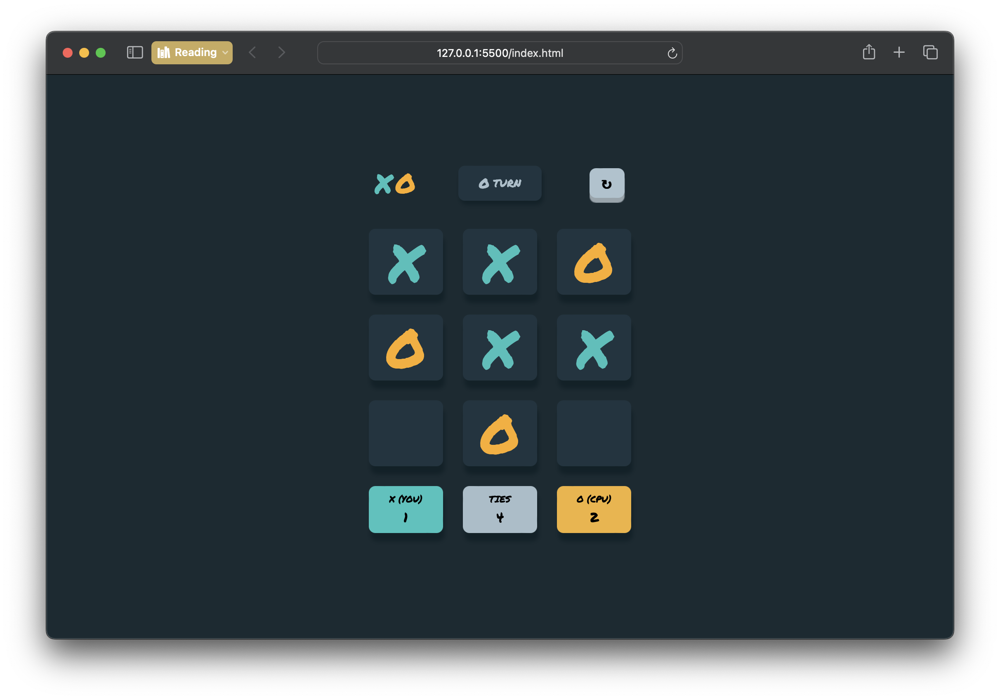
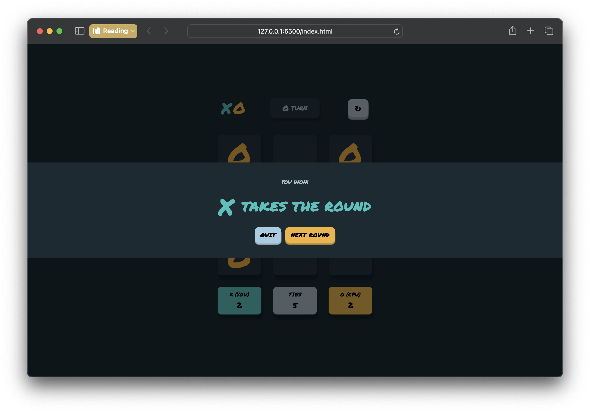

# Tic Tac Toe Game

This is a simple Tic Tac Toe game created using HTML, CSS, and JavaScript. The design is based on the challenge provided by Frontend Mentor.

## Table of Contents

- [Demo](#demo)
- [Features](#features)
- [Screenshot](#screenshot)
- [How to Play](#how-to-play)
- [Game Modes](#game-modes)
- [Design](#design)
- [Contributing](#contributing)
- [License](#license)

## Demo

A live demo of the game can be found [here]
(#) 

## Features

- Play Tic Tac Toe against a friend or the computer.
- Responsive design for various screen sizes.
- Beautifully designed user interface.

## Screenshot

## How to Play

1. **Start**: Open the game in your web browser.
2. **Game Board**: The game board consists of a 3x3 grid.
3. **Players**: Player 1 is 'X', and Player 2 or the CPU is 'O'.
4. **Gameplay**: Alternate turns placing 'X's and 'O's on the board.
5. **Winning**: The first player to get three of their marks in a row (horizontally, vertically, or diagonally) wins.
6. **Draw**: If the board fills up before a player wins, the game ends in a draw.

## Game Modes

- **Two Players**: Play against a friend on the same device.
- **Player vs CPU**: Challenge the computer with adjustable difficulty levels. (in development)

## Design

The design of this Tic Tac Toe game is inspired by [Frontend Mentor's Tic Tac Toe challenge](https://www.frontendmentor.io/challenges/tic-tac-toe-game-Re7ZF_E2v). It's implemented using HTML for structure, CSS for styling, and JavaScript for game logic.

## Contributing

Contributions are welcome! If you have any suggestions, bug fixes, or enhancements, feel free to open an issue or create a pull request.

## License

This project is licensed under the [MIT License](LICENSE).

---